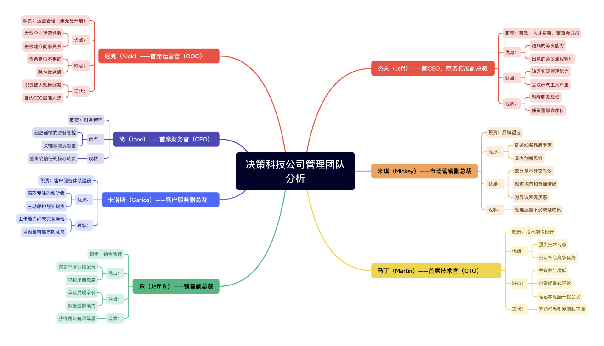
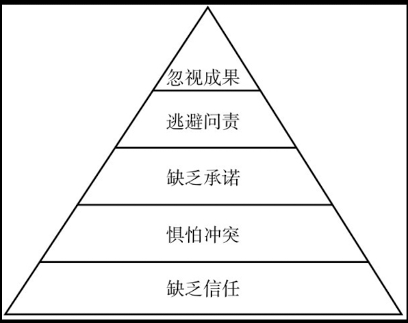
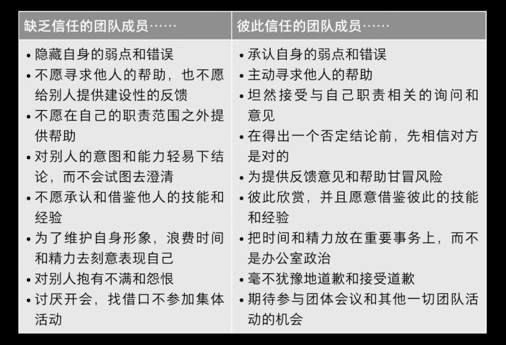
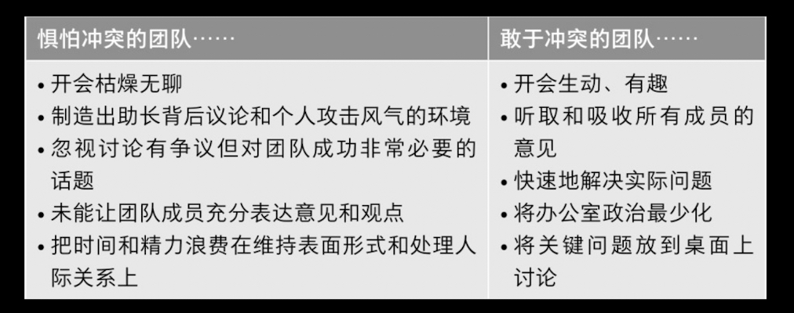
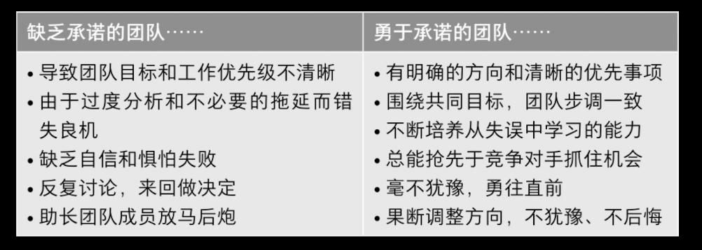
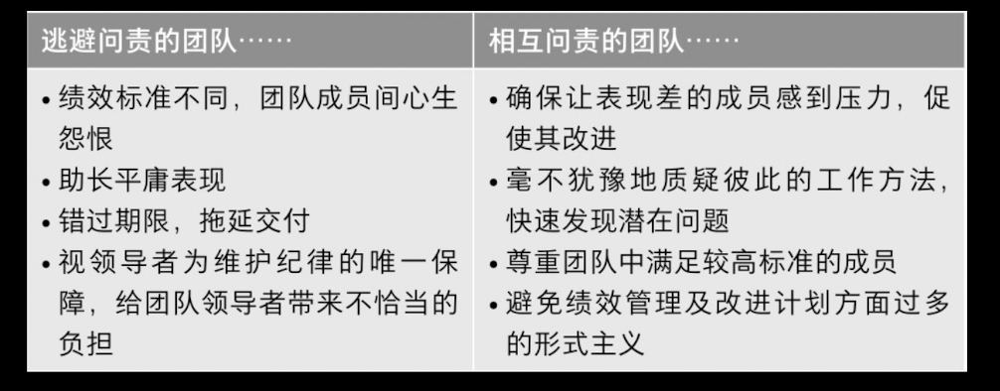
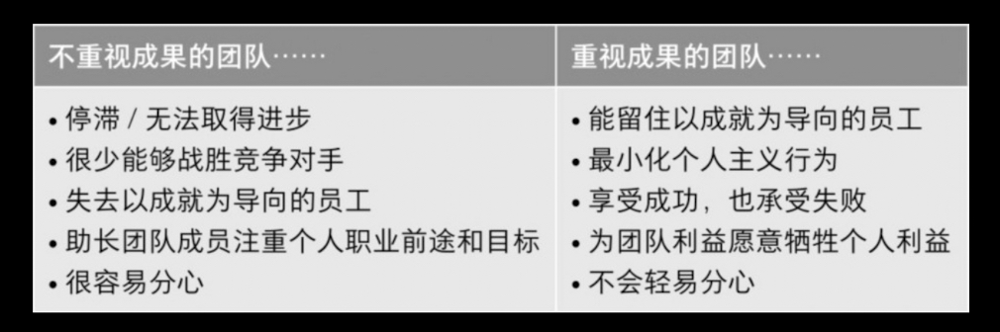

# 结论

把每一项障碍都“翻译”为行为习惯 + 管理机制，形成肌肉记忆、长期坚持，打造团队文化。

1. 缺乏信任: 建立心理安全感
2. 惧怕冲突: 就事论事，鼓励反对意见
3. 缺乏承诺: 形成团队共同决策
4. 逃避问责: 公开标准 + 日常反馈
5. 忽视成果: 定期复盘集体目标

# 一个小故事

# 五大障碍

注意: 从下往上看，

## 1. 缺乏信任

说明

1. 如何评估: 是否愿意在群体中表现出自己的脆弱？
2. 最佳状态: 相互信任
3. 提升办法: 建立个人化层面的的关系；MBTI测评、360度反馈
4. 领导者角色: 抛开面子；诚恳而不是表演

对比

## 2. 惧怕冲突

说明

1. 如何评估: 遇到冲突是拐弯抹角还是毫无顾虑？
2. 最佳状态: 围绕具体观点展开毫无顾虑的冲突
3. 提升办法: 挖掘冲突、升级冲突、TKI冲突测试(了解倾向性)
4. 团队领导者: 避免过度保护，参与冲突

## 3. 缺乏承诺

说明

1. 如何评估: 充分表达意见还是假装同意？
2. 最佳状态: 能对行动计划做出承诺
3. 提升办法: 瀑布式沟通练习；确定截止日期；强迫团队在研究不足的情况下做出决策
4. 团队领导者: 避免共识陷阱、确定性陷阱

对比

## 4. 逃避问责

说明

1. 如何评估: 是否愿意为了团队指出其他人的错误？
2. 最佳状态: 对于违反计划的行为互相问责
3. 提升办法: 公示目标和标准、定期回顾、团队嘉奖
4. 团队领导者: 建立问责机制、但是不能过于强势

对比

## 5. 忽视成果

说明

1. 如何评估: 个人利益(部门利益)是否凌驾于团队利益之上？
2. 最佳状态: 团队成员专注于达成集体成果
3. 提升办法: 公开成果声明、基于成果的奖励
4. 团队领导者: 无私客观、聚焦成果定调

对比

## 总结

1. 正视自己在人性方面的不完善，才能克服机能障碍
